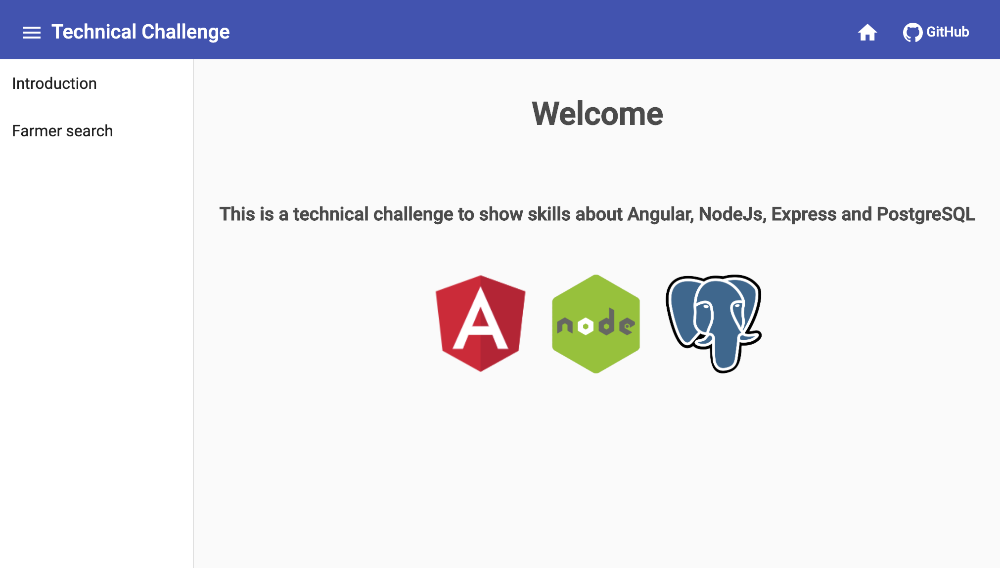
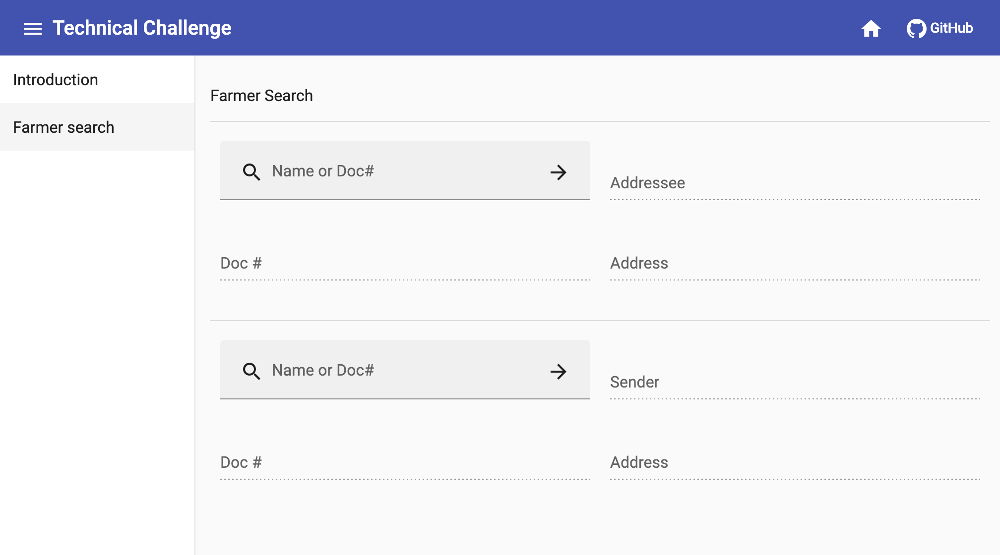
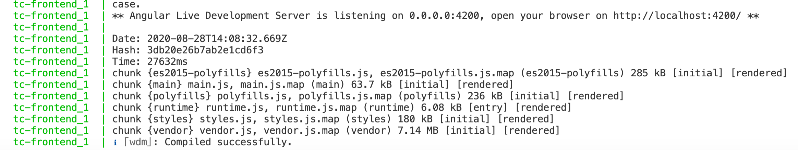

# Technical Challenge

## Table of Contents

* [Getting Started](#getting-started)
  * [Prerequisites](#prerequisites)
  * [Installation](#installation)
* [Usage](#usage)


## Getting Started

This is an example application using Angular 7, Material, NodeJs, Express and PostegreSQL.

When the containers are running you will be able to see the views shown below.

<br/>

<br/><br/>

<br/><br/>

### Prerequisites

You need to install docker and docker-compose.

- Full documentation is available on [Docker's website](https://docs.docker.com/get-docker/).

### Installation

Open your Terminal and follow the steps below:

1. Clone the repo
```sh
git clone https://github.com/rafael-veloso/tech_challenge.git
```
2. Select the new directory
```sh
cd tech_challenge
```
3. Enter the command
```sh
docker-compose up
```

It will create 3 containers, for the front end, for the backend and for the database.

When you want to stop and kill the containers, enter the command
```sh
docker-compose down
```


<!-- USAGE EXAMPLES -->
## Usage

After the containers are started you will see this line at your terminal from the frontend container: "Compiled successfully.".

Warn: The frontend container can take more time to get started, make sure you see this line at the end.




Then you can access the [Frontend](http://localhost:4200) local URL from your Browser.
You can access directly the [Backend](http://localhost:8080) as well if you want to test just the services.